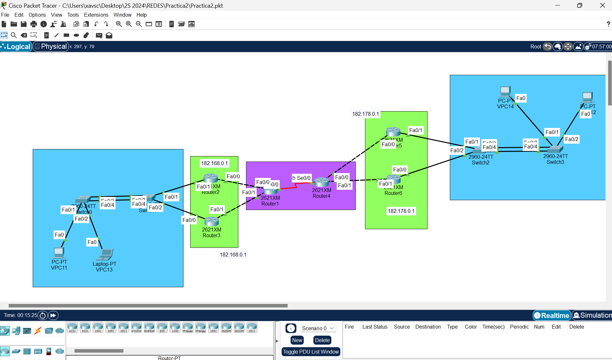
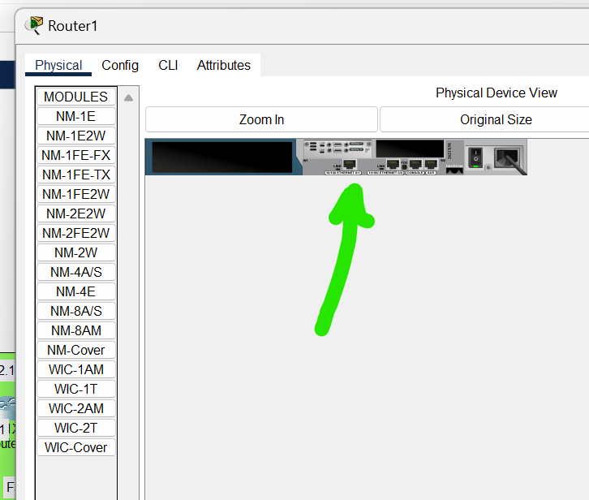
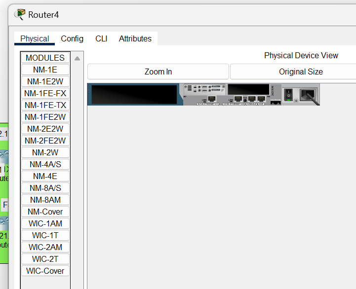
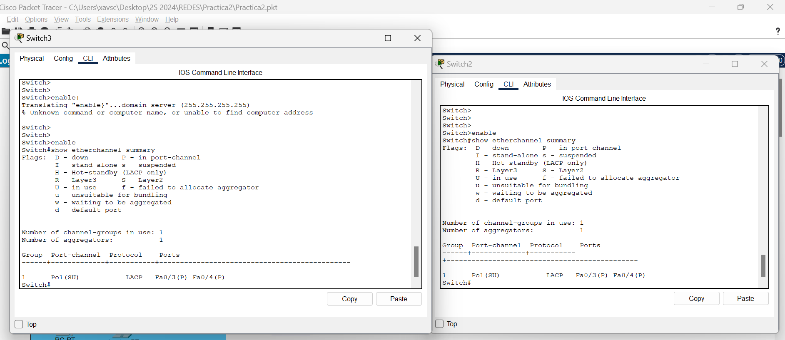
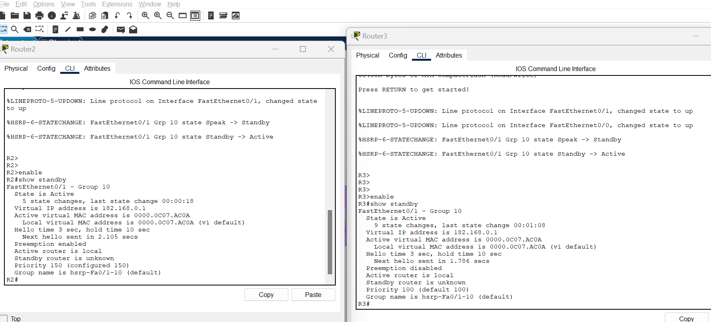
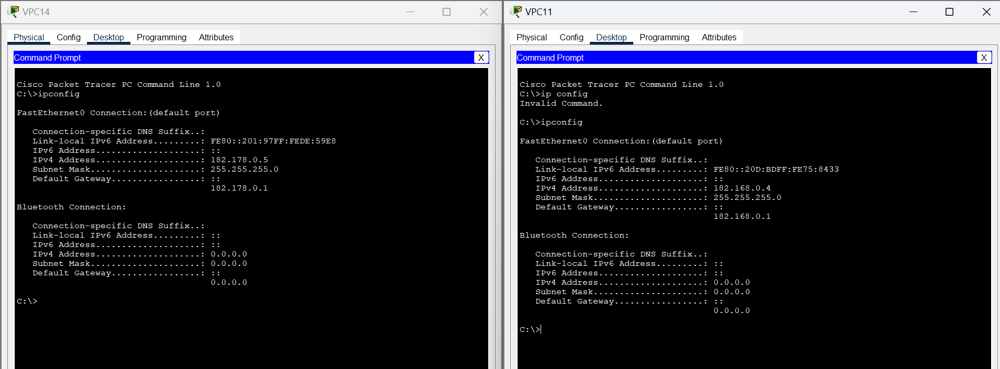

# Practica 2 Redes 

## Objetivos Generales
- Que el estudiante demuestre los conocimientos adquiridos en clase y ponga en práctica lo
aprendido para configurar enrutamiento entre redes.

## Objetivos Especificos

- Demostrar el conocimiento adquirido respecto a la agregación de enlaces.
- Demostrar el conocimiento adquirido para la creación de rutas estáticas.
- Demostrar el conocimiento adquirido respecto a la puerta de enlace
predeterminada, así como también para el manejo de protocolos de redundancia
en la misma.
- Emplear la herramienta PacketTracer para desarrollar la topología de acuerdo
con las especificaciones dadas.

## Herramientas necesarias

- Packet Tracer 

## Topologia desarrollada 



### Configuracion Router 1

- Comandos utilizados para la configuracion del router 1 el cual es de tipo serial.

```
enable
conf t
no ip domain-lookup
hostname R1
do wr

int s0/0
ip address 10.0.0.1 255.255.255.252
no shut

interface f0/0
ip address 182.168.1.2 255.255.255.248
no shutdown

interface f0/1
ip address 182.168.2.2 255.255.255.248
no shutdown

do wr
```

R1 configuracion serial



### Configuracion Router 2 

```
enable
conf t
no ip domain-lookup
hostname R2
do wr

interface f0/0
ip address 182.168.1.1 255.255.255.248
no shutdown

interface f0/1
ip address 182.168.0.2 255.255.255.0
standby 10 ip 182.168.0.1   
standby 10 priority 150
standby 10 preempt
no shutdown

do wr

```
### Configuracion Router 3

```
enable
conf t
no ip domain-lookup
hostname R3
do wr

interface f0/0
ip address 182.168.2.1 255.255.255.248
no shutdown

interface f0/1
ip address 182.168.0.3 255.255.255.0
standby 10 ip 182.168.0.1  
no shutdown

do wr
```

### Configuracion Router 4
```
enable
conf t
no ip domain-lookup
hostname R4
do wr

int s0/0
ip address 10.0.0.2 255.255.255.252
no shut

interface f0/0
ip address 182.178.1.1 255.255.255.248
no shutdown

interface f0/1
ip address 182.178.2.1 255.255.255.248
no shutdown
do wr
```

R4 configuracion serial


### Configuracion Router 5
```
R5
enable
conf t
no ip domain-lookup
hostname R5
do wr

interface f0/0
ip address 182.178.1.2 255.255.255.248

no shutdown

interface f0/1
ip address 182.178.0.2 255.255.255.0
standby 10 ip 182.178.0.1  
standby 10 priority 150
standby 10 preempt
no shutdown

do wr
```
### Configuracion Router 6

```
R6
enable
conf t
no ip domain-lookup
hostname R6
do wr

interface f0/0
ip address 182.178.2.2 255.255.255.248

no shutdown

interface f0/1
ip address 182.178.0.3 255.255.255.0
standby 10 ip 182.178.0.1
no shutdown

do wr
```
### Configuracion Router SW0

```
enable
configure terminal
interface range fa0/3 - 4
channel-group 1 mode auto
exit
interface port-channel 1
switchport mode trunk
exit
do wr 

```

### Configuracion SW1

```
enable
conf t
interface range fa0/3 - 4
channel-group 1 mode desirable
exit
interface port-channel 1
switchport mode trunk
exit
do wr

```


### Configuracion SW2
```
enable
configure terminal
interface range fa0/3 - 4
channel-group 1 mode active
exit
interface port-channel 1
switchport mode trunk
exit
do wr
```
### Configuracion SW3
```
enable
configure terminal
interface range fa0/3 - 4
channel-group 1 mode passive
exit
interface port-channel 1
switchport mode trunk
exit
do wr
```
### Configuracion R1

```
enable
configure terminal

ip route 182.168.1.0 255.255.255.248 182.168.1.1
ip route 182.168.2.0 255.255.255.248 182.168.2.1
ip route 182.168.0.0 255.255.255.0 182.168.1.1
ip route 182.168.0.0 255.255.255.0 182.168.2.1
ip route 10.0.0.0 255.255.255.252 10.0.0.2
ip route 182.178.1.0 255.255.255.248 10.0.0.2
ip route 182.178.2.0 255.255.255.248 10.0.0.2
ip route 182.178.0.0 255.255.255.0 10.0.0.2
do write
end
write memory
```
### Configuracion R2
```
enable
configure terminal

ip route 182.168.1.0 255.255.255.248 182.168.1.2
ip route 10.0.0.0 255.255.255.252 182.168.1.2
ip route 182.178.1.0 255.255.255.248 182.168.1.2
ip route 182.178.2.0 255.255.255.248 182.168.1.2
ip route 182.178.0.0 255.255.255.0 182.168.1.2
do wr
end
write memory
```


### Configuracion Router 3
```
enable
configure terminal

ip route 182.168.2.0 255.255.255.248 182.168.2.2
ip route 10.0.0.0 255.255.255.252 182.168.2.2
ip route 182.178.1.0 255.255.255.248 182.168.2.2
ip route 182.178.2.0 255.255.255.248 182.168.2.2
ip route 182.178.0.0 255.255.255.0 182.168.2.2
do wr
end
write memory
```


### Configuracion Router 4
```
enable
configure terminal

ip route 182.178.1.0 255.255.255.248 182.178.1.2
ip route 182.178.2.0 255.255.255.248 182.178.2.2
ip route 182.178.0.0 255.255.255.0 182.178.1.2
ip route 182.178.0.0 255.255.255.0 182.178.2.2
ip route 10.0.0.0 255.255.255.252 10.0.0.1
ip route 182.168.1.0 255.255.255.248 10.0.0.1
ip route 182.168.2.0 255.255.255.248 10.0.0.1
ip route 182.168.0.0 255.255.255.0 10.0.0.1
do wr
```

### Configuracion Router 5
```
enable
configure terminal

ip route 182.178.1.0 255.255.255.248 182.178.1.1
ip route 10.0.0.0 255.255.255.252 182.178.1.1
ip route 182.168.1.0 255.255.255.248 182.178.1.1
ip route 182.168.2.0 255.255.255.248 182.178.1.1
ip route 182.168.0.0 255.255.255.0 182.178.1.1
do wr
end
write memory
```

### Configuracion Router 6
```
enable
configure terminal

ip route 182.178.2.0 255.255.255.248 182.178.2.1
ip route 10.0.0.0 255.255.255.252 182.178.2.1
ip route 182.168.1.0 255.255.255.248 182.178.2.1
ip route 182.168.2.0 255.255.255.248 182.178.2.1
ip route 182.168.0.0 255.255.255.0 182.178.2.1
do wr
end
write memory
```
### Configuracion Portchanel con PAGP switches SW0-SW1


### Configuracion Portchanel LACP switches SW2-SW3. 



### Configuracion IP virtual R2-R3



### Configuracion VPC11 y VPC14

